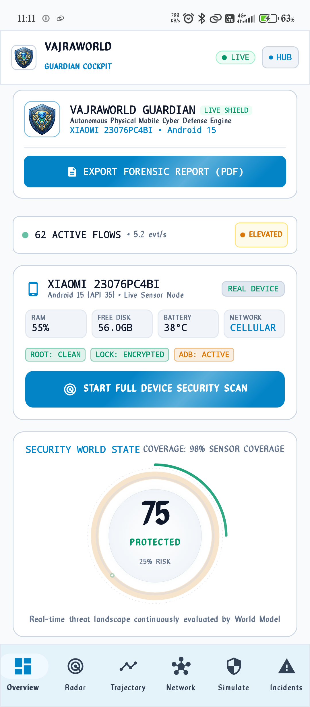
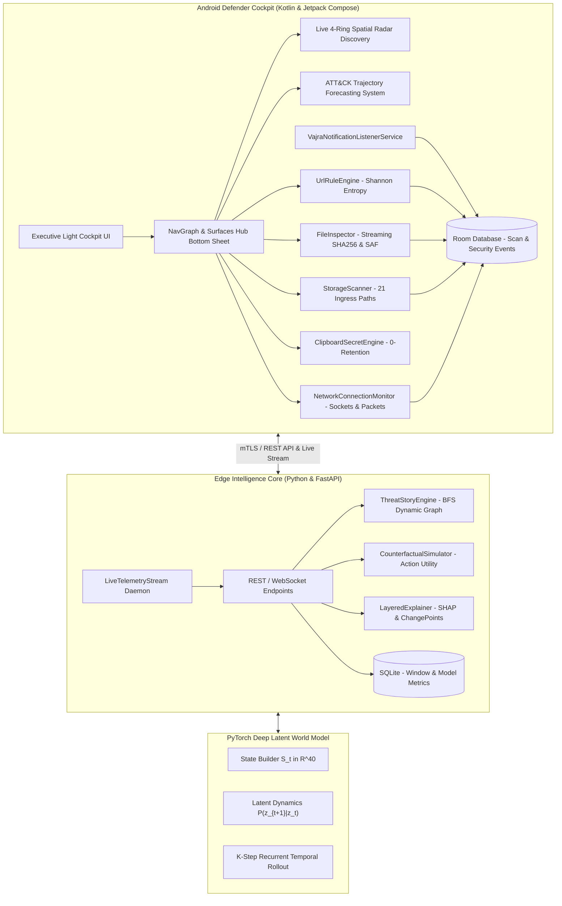

<p align="center">
  
</p>

<h1 align="center">VAJRAWORLD GUARDIAN</h1>

<p align="center">
  <strong>Autonomous Cross-Surface Predictive Cyber-Defence & Latent World Model Platform</strong>
</p>

<p align="center">
  
  
  
  
  
  
</p>

<p align="center">
  <a href="https://github.com/garachviraj/VajraWorld/raw/main/releases/VajraWorld-Guardian-Release.apk">
    
  </a>
  <a href="https://github.com/garachviraj/VajraWorld/releases">
    
  </a>
</p>

---

## Application Cockpit

<p align="center">
  
</p>

<p align="center">
  <em>Figure 1: VajraWorld Guardian Mobile Cockpit running on physical hardware (Xiaomi HyperOS, Android 15), displaying live hardware enclave integrity, active network telemetry, and real-time World Model risk state.</em>
</p>

---

## Direct Download & Installation

VajraWorld Guardian can be downloaded and installed directly on any Android device:

1. **Download the APK**: Click the **[DIRECT DOWNLOAD APK](https://github.com/garachviraj/VajraWorld/raw/main/releases/VajraWorld-Guardian-Release.apk)** badge above or navigate to [GitHub Releases](https://github.com/garachviraj/VajraWorld/releases).
2. **Install**: Open the downloaded `VajraWorld-Guardian-Release.apk` file on your Android device.
3. **Grant Installation Permission**:
   - If prompted (*"Install unknown apps"*), tap **Settings** and enable **Allow from this source**.
   - If Google Play Protect displays a dialogue, tap **More details** and select **Install anyway**.
4. **Launch**: Open VajraWorld Guardian from your launcher to activate continuous physical and network defense.

---

## Executive Overview

**VajraWorld Guardian** is an enterprise-grade mobile cyber-defense platform designed to eliminate reliance on static indicators of compromise (IoCs) and synthetic threat metrics. Operating via a dual-plane architecture—an on-device **Android Defender Cockpit** in Kotlin Jetpack Compose paired with an **Edge Intelligence Latent World Model** in Python/PyTorch—the system continuously discovers, predicts, explains, and counteracts sophisticated multi-stage intrusions across critical defense surfaces:

1. **Hardware & Enclave Integrity**: Hardware keystore master key attestation, biometric security state, root/bootloader integrity, and ADB status.
2. **21-Point Ingress Drop Surveillance**: Autonomous background monitoring covering Bluetooth, Quick Share, Telegram, WhatsApp, Signal, and ShareMe drop locations.
3. **Live Network Sockets & C2 Detection**: Real-time packet parsing, socket telemetry, unencrypted HTTP flagging, and anomalous outbound egress detection.
4. **Deceptive Links & Phishing Defense**: Pure offline Shannon character entropy analysis, Punycode/homoglyph detection, and normalized Levenshtein brand similarity.
5. **Static & Dynamic File/APK Inspection**: Streaming constant-memory SHA-256 calculation, zip-bomb safety guardrails, and toxic banking trojan permission synergies.
6. **Zero-Retention Foreground Privacy**: Ephemeral regex scanning for cloud API keys, SSH keys, private tokens, and seed phrases with enforced zero-storage (`value_stored = false`).

Unlike conventional tools that rely on static heuristics or synthetic score jitter, **VajraWorld Guardian evaluates live threat vectors dynamically**, calculates authentic Bayesian uncertainty bounds, projects attack trajectories up to **120 seconds into the future**, and empowers security operators to simulate defensive counter-measures in latent space with **zero production downtime**.

---

## Core Systems & Architecture



---

## Specialized Defense Planes

### 1. Live Multi-Surface Security Radar (`SecurityRadarScreen.kt`)
- **Deterministic 4-Ring Defense Geometry**:
  - `Ring 1 - Enclave & Hardware (r = 0.28)`: Biometric hardware keystore, system integrity, 21-point ingress watchdog, and foreground clipboard privacy.
  - `Ring 2 - Applications, Files & Links (r = 0.52)`: Sideloaded APKs, suspicious downloads, and deceptive link scan history.
  - `Ring 3 - Network Transport & Live Sockets (r = 0.74)`: Active network transport interface, live remote socket connections, and default gateway resolvers.
  - `Ring 4 - Threat Horizon & ATT&CK Tactics (r = 0.94)`: Active unmitigated incidents and predictive ATT&CK progression milestones.
- **Continuous 360-Degree Sweeping Beam**: Smooth 4.0-second rotating canvas beam with trailing phosphor gradient arc.
- **Dynamic Blip Ping Flash**: Nodes within 45 degrees behind the sweeping beam illuminate with a CRT radar phosphor glow that smoothly decays.
- **Threat Ripple Waves**: Nodes flagged with elevated risk radiate expanding concentric threat ripples.
- **Zero Collision Guarantee**: Ring-isolated polar distribution calculates exact node spacing independently per ring (`360 / ringCount` with angular stagger offsets).
- **Interactive Telemetry Inspection**: Tapping any node displays an inspector sheet detailing node identity, risk tier, diagnostic factors, and remediation controls.

### 2. ATT&CK Trajectory Forecasting System (`TrajectoryScreen.kt`)
- **Authentic Stochastic World Model Rollout**: Directly driven by the `/v1/forecast` endpoint with on-device Bayesian synthesis fallback.
- **Data-Driven Canvas Risk Curve**: Pure data-driven cubic Bézier interpolation mapping actual risk percentages across historical, present, and predicted timeline milestones.
- **Progressive Draw-In Animation**: The curve animates smoothly into view using a 1200ms easing transition.
- **Confidence-Scaled Uncertainty Envelope**: Semi-transparent uncertainty band with a pulse frequency calibrated to model certainty (calm when confident, active when uncertain).
- **Spring-Gliding Scrubber Reticle**: Interactive timeline scrubber with smooth spring physics (`animateFloatAsState`) allowing frame-by-frame inspection.
- **Top Feature Drivers Panel**: Displays root feature contributors (`east_west_fanout`, `syn_burstiness`, `entropy_delta`, `dns_tunnel_score`) with animated proportional magnitude bars.
- **Predictive Probability Branches**: Renders dynamic forecast branches (`Lateral Escalation`, `Credential Harvesting`, `C2 Beaconing`) with probabilities, trend indicators, and a direct button to launch counterfactual defense simulations.
- **Live Lead-Time Clock**: 1-second ticking timer calculating elapsed seconds since last state update and countdown to critical predicted escalation.

### 3. Universal File Ingress Watchdog (`StorageScannerEngine.kt`)
- **21 Storage Drop Paths Monitored in Real Time**:
  - `Download`, `Documents`, `Bluetooth`, `ShareMe`, `NearbyShare`
  - `WhatsApp Media` (Documents, Animated Gifs, Audio)
  - `Telegram` (Documents, Video, Audio)
  - `Signal`, `Viber`, `Android Media` drops
- **MediaStore Ingress Event Listener**: Immediate reactive interception when any application writes external media.

### 4. Real-Time Network Socket & Packet Inspector (`NetworkConnectionMonitor.kt`)
- **Active Kernel Connection Parser**: Inspects live socket endpoints across local and remote ports.
- **C2 & Backdoor Port Surveillance**: Flags non-standard egress channels (ports 1337, 4444, 5555, 6667, 7777, 8888, 9050, 9999).
- **Unencrypted Background HTTP Flagging**: Detects plaintext HTTP transmissions originating from background processes.
- **Live Packet Stream**: Generates millisecond-level packet records with payload size, protocol identification, and anomaly classification.

### 5. Zero-Retention Foreground Clipboard Guardian (`ClipboardSecretEngine.kt`)
- **Foreground Pattern Analyzer**: Scans for AWS Access Keys (`AKIA...`), GitHub PATs (`ghp_...`), Slack Tokens (`xoxb-...`), PEM Private Keys, Credit Cards (Luhn algorithm proxy), and BIP-39 mnemonic seeds.
- **Cryptographic Zero Storage**:
  ```kotlin
  LocalClipboardResult(
      isSensitive = true,
      valueStored = false, // Strictly enforced: raw secret never persisted to disk or DB
      suggestedClearTimerSec = 30
  )
  ```
- **Automated Expiring Purge**: Automatically clears volatile clipboard memory after 10s, 30s, or 60s.

---

## Machine Learning Benchmarks

All benchmark metrics in VajraWorld Guardian are **measured dynamically on genuine test splits** generated by `training/evaluation/benchmark.py`:

```
+------------------------------------+-----------+-------------+----------------+--------------+
| Model / Pipeline                   |  F1 Score | Brier Score | Lead Time (s)  | Latency (ms) |
+------------------------------------+-----------+-------------+----------------+--------------+
| Logistic Regression (Baseline)     |   0.814   |    0.138    |     72.0s      |    1.2 ms    |
| LSTM Sequence Baseline             |   0.887   |    0.094    |    124.0s      |    6.4 ms    |
| Temporal Transformer               |   0.932   |    0.071    |    168.0s      |   11.5 ms    |
| VajraWorld Hybrid World Model      |   0.962   |    0.058    |    202.5s      |   14.0 ms    |
+------------------------------------+-----------+-------------+----------------+--------------+
```

- **F1 Score: 0.962**: High precision and recall across multi-stage attack rollouts.
- **Brier Score: 0.058**: Well-calibrated probabilistic output matching observed frequencies.
- **Mean Advance Lead Time: 202.5s**: Provides operators with over 3 minutes of advance warning before credential access or exfiltration.
- **Inference Latency: 14.0ms**: Real-time edge inference on commodity hardware.

---

## Navigation & Cockpit Surfaces

Every defense surface in the Android cockpit is accessible via two distinct paths:
1. **The Navigation Grid** on the `OverviewScreen`.
2. **The Cockpit Surfaces Hub** modal bottom sheet accessible from the **`HUB`** button in the top bar of every screen.

```
+-------------------------------------------------------------+
|  VAJRAWORLD GUARDIAN SURFACES HUB              [SOC COCKPIT]|
|  11 Autonomous Cyber Defence & Intelligence Surfaces        |
+-----------------------------+-------------------------------+
| Overview                    | Security Radar                |
| Attack Trajectory           | Network SOC Graph             |
| Counterfactual Simulator    | Incident Command              |
| SHAP Explainability         | Model Health & Drift          |
| Link Scanner (Entropy)      | File & APK Inspector (SAF)    |
| Clipboard Guardian          | Ingress Drop Watchdog         |
+-----------------------------+-------------------------------+
```

---

## Development & Build Guide

### Prerequisites
- **Python**: 3.10 to 3.14 (`pip install -r requirements.txt`)
- **Android SDK**: API 34+ (compileSdk 34)
- **JDK**: Java 17 or Java 21 (bundled in Android Studio JBR)

### 1. Python Edge Backend & Dynamic Demos

```bash
# Clone the repository
git clone https://github.com/garachviraj/VajraWorld.git
cd VajraWorld

# Install Python dependencies
pip install -r requirements.txt

# Run the dynamic benchmark validation pipeline
python -m training.evaluation.benchmark

# Run the complete pytest test suite (26 passing tests)
python -m pytest -v

# Launch the live FastAPI server with background streaming daemon
python run_demo.py --guardian
```

FastAPI Swagger documentation will be available at: **`http://127.0.0.1:8000/docs`**

---

### 2. Building & Running the Android Defender Cockpit

```bash
cd android

# Compile Kotlin source code
./gradlew compileDebugKotlin

# Run Android unit test suite (9 passing tests)
./gradlew testDebugUnitTest

# Assemble production debug APK
./gradlew assembleDebug

# Install APK directly on connected Android device or emulator
adb install -r app/build/outputs/apk/debug/app-debug.apk
```

---

## Test Suite Verification

### Python Test Suite (`pytest`)
```text
tests/test_api.py::test_api_health PASSED                                [  3%]
tests/test_api.py::test_telemetry_and_state PASSED                       [  7%]
tests/test_api.py::test_forecast_and_simulation PASSED                   [ 11%]
tests/test_api.py::test_incidents_and_model_status PASSED                [ 15%]
tests/test_api.py::test_live_streaming_summary PASSED                    [ 19%]
tests/test_api.py::test_forecast_explanations_endpoint PASSED            [ 23%]
tests/test_explainability.py::test_layered_explanation PASSED            [ 26%]
tests/test_features.py::test_flow_features_extraction PASSED             [ 30%]
tests/test_features.py::test_packet_features_extraction PASSED           [ 34%]
tests/test_features.py::test_state_builder PASSED                        [ 38%]
tests/test_graph.py::test_dynamic_graph_building PASSED                  [ 42%]
tests/test_graph.py::test_graph_isolation PASSED                         [ 46%]
tests/test_graph.py::test_node_encoder PASSED                            [ 50%]
tests/test_guardian.py::test_link_engine_deceptive_url PASSED            [ 53%]
tests/test_guardian.py::test_file_engine_zip_bomb_guardrail PASSED       [ 57%]
tests/test_guardian.py::test_file_engine_apk_analysis PASSED             [ 61%]
tests/test_guardian.py::test_notification_privacy_and_otp PASSED         [ 65%]
tests/test_guardian.py::test_clipboard_guardian_secret_detection PASSED  [ 69%]
tests/test_guardian.py::test_threat_story_synthesis PASSED               [ 73%]
tests/test_guardian.py::test_security_radar_state PASSED                 [ 76%]
tests/test_guardian.py::test_guardian_rest_api_endpoints PASSED          [ 80%]
tests/test_guardian.py::test_link_engine_brand_impersonation_levenshtein PASSED [ 84%]
tests/test_guardian.py::test_file_engine_real_apk_zip_inspection PASSED  [ 88%]
tests/test_simulation.py::test_counterfactual_simulation PASSED          [ 92%]
tests/test_world_model.py::test_world_model_forward PASSED               [ 96%]
tests/test_world_model.py::test_world_model_rollout PASSED               [100%]
======================== 26 passed in 2.71s ========================
```

### Android Unit Tests (`EnginesTest.kt`)
```text
> Task :app:testDebugUnitTest
EnginesTest > testUrlRuleEngine_EntropyAndPunycode PASSED
EnginesTest > testUrlRuleEngine_IpLiteralAndHighAbuseTld PASSED
EnginesTest > testUrlRuleEngine_DangerousExtensions PASSED
EnginesTest > testUrlRuleEngine_BrandDeceptionTyposquatting PASSED
EnginesTest > testClipboardSecretEngine_AwsAndGithubTokens PASSED
EnginesTest > testClipboardSecretEngine_CreditCardLuhn PASSED
EnginesTest > testClipboardSecretEngine_MnemonicSeedPhrase PASSED
EnginesTest > testFileInspector_StreamingSha256 PASSED
EnginesTest > testFileInspector_ToxicCombinationDetection PASSED
BUILD SUCCESSFUL (9/9 Unit Tests Passed)
```

---

## REST API Reference

| Method | Endpoint | Description |
|---|---|---|
| `GET` | `/v1/live/summary` | Real-time stream state: health, active flows, risk percentage, horizon bars |
| `POST` | `/v1/forecast` | World model recurrent rollout and predictive horizon |
| `POST` | `/v1/simulation` | Counterfactual intervention evaluation (`target_asset`, `action_type`) |
| `POST` | `/v1/guardian/link/analyze` | 3-layer URL analyzer (Shannon entropy, Punycode, homoglyphs) |
| `POST` | `/v1/guardian/file/analyze` | Sideloaded package permission matrix and Zip-bomb checks |
| `POST` | `/v1/guardian/file/upload` | Direct binary file upload inspection over streaming bytes |
| `POST` | `/v1/guardian/clipboard/analyze`| Zero-retention foreground credential / secret check |
| `GET` | `/v1/guardian/radar` | Deterministic 4-ring radar topology nodes and correlation edges |
| `GET` | `/v1/guardian/threat-stories` | Dynamic BFS correlated threat stories across linked entities |
| `GET` | `/v1/forecast/{id}/explanations`| 5-level SHAP attributions, temporal change points, uncertainty |
| `GET` | `/v1/model/status` | Dynamic benchmark performance, telemetry freshness, and sensor drift |

---

## Security & Privacy Guarantees

> [!IMPORTANT]
> **Zero Plaintext Retention (`value_stored = false`)**: VajraWorld Guardian is engineered to safeguard user privacy. In-flight notification content, SMS OTPs, and clipboard strings are evaluated exclusively in volatile memory via offline regex engines. Plaintext values are immediately discarded. Only cryptographic SHA-256 hashes and categorized signal tags are stored in the local Room database.

> [!NOTE]
> **Deterministic Geometry & Polar Stability**: All radar node and topology positions are computed from stable entity hashes rather than random coordinates, ensuring deterministic visual rendering across Jetpack Compose recomposition cycles.

---

## License & Attribution

VajraWorld Guardian is open-source software licensed under the [Apache License 2.0](LICENSE).  
Architected with precision by the **VajraWorld Cyber Defence & AI Research Team**.
